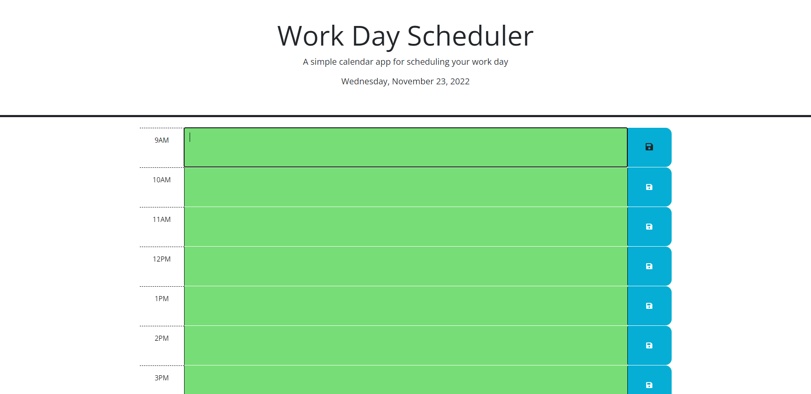

# <Calendar-App>

## Description

The motivation behind this application was to create a tool to keep track of your daily schedule. I built this to have a site that can be accessed anywhere that saves my tasks online for me to view and track. It solves the problem of a physical calendar that cannot be accessed from anywhere and creating a color-coded, easy to read format for tasks of the day. I learned how to utilize bootstrap and jquery to create a responsive and clean ui for a web application and how to loop using $(this).

## Table of Contents (Optional)
N/A

## Installation

No installation required. Access application at Url "https://jeremyskinner812.github.io/calendar-app/

## Usage

To use, input your tasks into the time-block that it needs to be completed. The time-blocks are color-coded. Blocks in the past are grey, current time-block is red, and future time-blocks are green. After typing in your tasks, click the blue save button on the right of your text. When the page is reloaded, the tasks will still be there.

   

## Credits

Starter code for application from UCI Coding Bootcamp

## License

N/A

## Features

Inputs saved in local storage. 
Auto updates time and date every 60 seconds.
Inputs will still be there when revisiting page after ending session.

